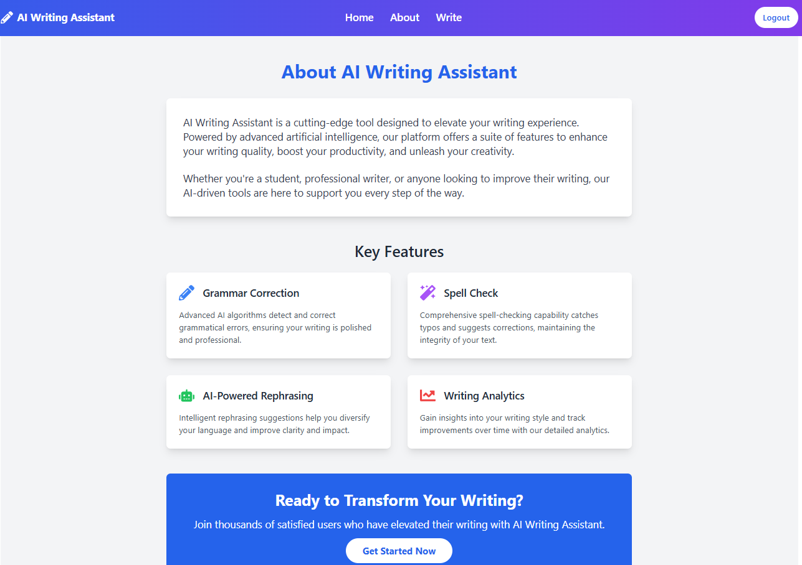
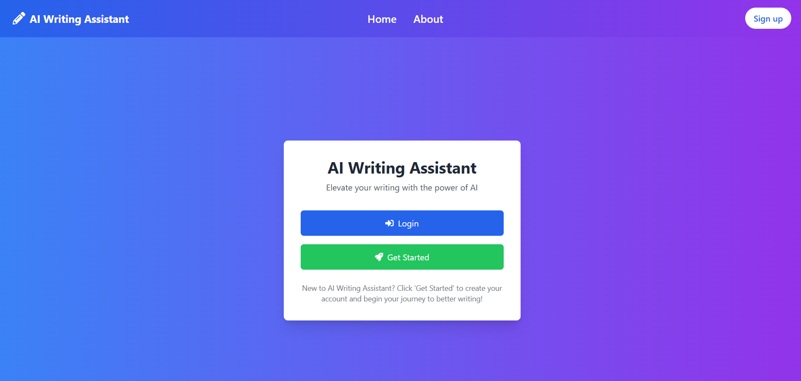
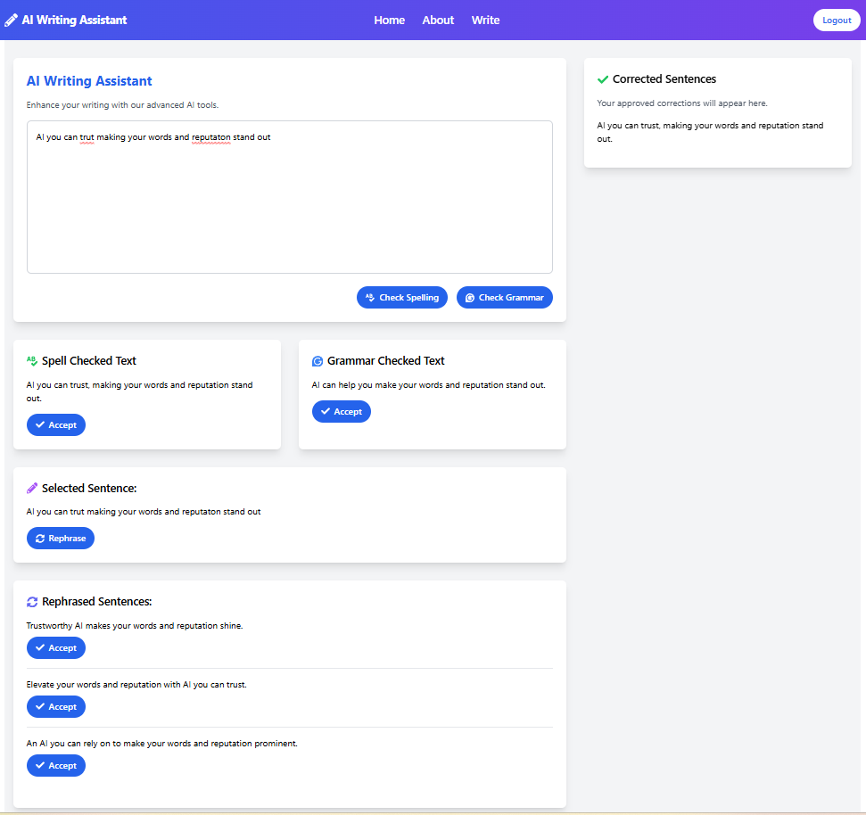

# ✍️ AI Writing Assistant

AI Writing Assistant is a fully functional AI-powered tool that helps users improve their writing with intelligent suggestions, grammar corrections, and alternative phrasings — all in real-time.  
Whether you're drafting an email, preparing a report, or writing creative content, AI Writing Assistant ensures your words are **clear, accurate, and impactful**.

---

## 🚀 Features

- **🔡 Spell Check** – Automatically detect and correct spelling errors to ensure accuracy.  
- **📝 Grammar Checks** – Improve sentence structure and clarity with real-time grammar suggestions.  
- **🔄 Rephrasing** – Get alternative phrasings to refine tone, improve flow, and enhance readability.  
- **🔐 Authentication** – Secure user authentication via **Privy.io**, ensuring personalized and safe access.  

---

## 🛠 Tech Stack

- **Backend** – Node.js, Express  
- **Frontend** – React.js, JavaScript, TailwindCSS  
- **Authentication** – [Privy.io](https://www.privy.io/)  
- **AI Model** – Gemini API (Chat Completion)  

---

## 📦 Installation Guide

Follow these steps to run the project locally:

```bash
# 1️⃣ Clone the repository
git clone https://github.com/yourusername/ai-writing-assistant.git
cd ai-writing-assistant

# 2️⃣ Install dependencies for backend & frontend
cd server
npm install

cd ../client
npm install

# 3️⃣ Add environment variables
# Create a `.env` file in backend and frontend folders
# Backend example:
PORT=3000
GEMINI_API_KEY=your_api_key_here
PRIVY_API_KEY=your_privy_key_here

# 4️⃣ Start backend server
cd server
npm start

# 5️⃣ Start frontend
cd ../client
npm run dev 
```

---

## 🖼 Screenshots

### Home Page


### About Page


### Sign Up Page


### Write Page


